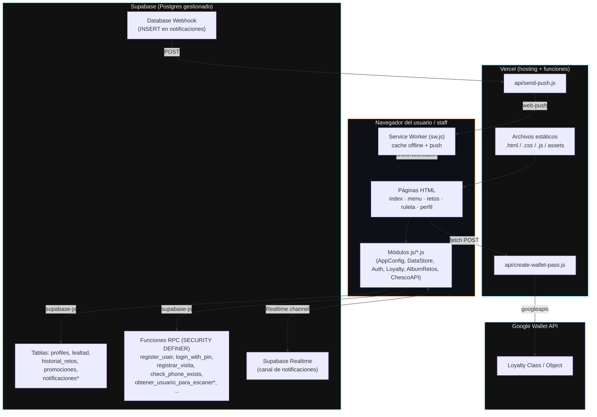

# Arquitectura General

## Stack

| Capa | Tecnología | Notas |
|---|---|---|
| Frontend | HTML5 + CSS3 + JavaScript ES6+ "vanilla" | Sin framework (no React/Vue), sin bundler, sin build step. IIFEs (`(function(){...})()`) como módulos. |
| Estilos | `css/theme.css`, `css/landing.css`, `css/profile.css` | Compartidos entre páginas; ver [FRONTEND.md](./FRONTEND.md). |
| Base de datos | Supabase (Postgres gestionado) | Acceso vía `@supabase/supabase-js` v2 (CDN). Lógica de negocio sensible vive en funciones RPC de Postgres (`SECURITY DEFINER`), no en el cliente. |
| Backend propio | 2 Vercel Functions en `api/*.js` (Node.js, `module.exports = async function handler(req, res)`) | Google Wallet y envío de push. |
| Hosting / deploy | Vercel (sitio estático + funciones serverless) | Carpeta `.vercel/` (gitignored) guarda el link al proyecto. |
| PWA | `manifest.json` + `sw.js` (Service Worker) | Cachea assets estáticos, soporta `beforeinstallprompt` y notificaciones push nativas. |
| Notificaciones push reales | Web Push API + `web-push` (VAPID) | Disparadas por un *Database Webhook* de Supabase cuando se inserta en `notificaciones`, no directamente por el frontend. |

No hay `npm run build`, `webpack`, `vite` ni similar: los archivos `.html`,
`.css` y `.js` se sirven tal cual. `package.json` solo declara las
dependencias de las **funciones serverless** de `api/` (no del frontend).

## Diagrama de capas

`*` = tabla/función usada por el código pero **no incluida** en los `.sql`
versionados en este repo (ver [DATABASE.md](./DATABASE.md#faltantes)); debe
existir directamente en el dashboard de Supabase.

## Autenticación: por qué PIN y no Supabase Auth

El proyecto **no usa** `auth.users` de Supabase ni magic links/OTP por SMS
(explícitamente evitado por costo/complejidad para un negocio local). En su
lugar:

1. `profiles` es una tabla propia con `id UUID`, `username`, `telefono`, `pin`
   (texto plano, ver nota de seguridad abajo) y `rol`.
2. `register_user(p_username, p_phone, p_pin)` y `login_with_pin(p_phone,
   p_pin)` son funciones RPC `SECURITY DEFINER` que validan/crean el perfil
   directamente en Postgres.
3. El frontend (`js/auth.js`) guarda la sesión resultante en
   `localStorage` (`chesko_session`) con un timestamp, y la usa "tal cual"
   durante 30 minutos (`SESSION_TTL_MS`) antes de re-verificar contra la BD,
   priorizando que una reconexión lenta nunca cierre sesión al usuario.

⚠️ **Nota de seguridad**: la columna `pin` se guarda y compara en texto
plano (`WHERE telefono = p_phone AND pin = p_pin`, ver
`sql/supabase-schema.sql`). Es aceptable para el modelo de amenaza actual
(RLS deshabilitado a propósito, negocio local pequeño, PIN de 4 dígitos como
conveniencia, no como seguridad fuerte) pero es importante que cualquiera que
extienda el sistema lo sepa antes de asumir que es un login "seguro" en el
sentido convencional.

## Roles

`profiles.rol` ∈ `{'usuario', 'empleado', 'admin'}` (CHECK constraint en SQL).
Solo `empleado`/`admin` ven el botón "📷 Escanear QR de cliente" en
`perfil.html` y pueden llamar `registrar_visita` sobre **otro** usuario vía el
flujo de escaneo (ver [DATA_FLOW.md](./DATA_FLOW.md)). No hay panel de admin
separado: los roles se asignan manualmente por SQL
(`UPDATE profiles SET rol = 'admin' WHERE telefono = '...'`).

## Despliegue

- Hosteado en Vercel, proyecto `cheskoretos` (ver `.vercel/repo.json`, no
  versionado en git salvo por ese archivo informativo).
- Variables de entorno de las funciones serverless (`GOOGLE_WALLET_*`,
  `VAPID_*`, `SUPABASE_URL`, `SUPABASE_ANON_KEY`) se configuran en el
  dashboard de Vercel — ver plantilla en `example.env` y cabeceras de cada
  archivo en `api/`.
- Las credenciales de Supabase del **frontend** (`SUPABASE_URL`,
  `SUPABASE_ANON_KEY`) están hardcodeadas en `js/config.js` — es la práctica
  normal para la anon key pública de Supabase (protegida por no tener RLS
  granular en este caso, sino por lógica de servidor en las RPC), no un
  secreto de servidor.
- El Service Worker (`sw.js`) usa cache-busting manual por versión
  (`CACHE_NAME = 'cheskoretos-v7'`): al cambiar archivos estáticos hay que
  subir ese número para invalidar el caché de los usuarios.
