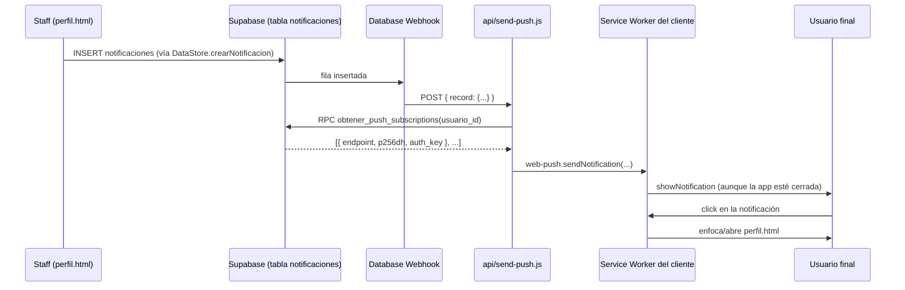

# Backend propio: funciones serverless (`api/*.js`)

Dos funciones desplegadas como **Vercel Functions** (Node.js). Ambas exportan
`module.exports = async function handler(req, res) { ... }`, la convención
que Vercel espera para archivos dentro de `api/`.

## `api/create-wallet-pass.js`

**Quién la llama**: `agregarAGoogleWallet()` en `js/app.js`, desde el botón
"Agregar a Google Wallet" de `perfil.html` (nota: ese botón fue removido del
HTML de `perfil.html` en la fusión con `perfil2.html`; la función de `app.js`
y este endpoint siguen existiendo pero hoy no hay UI que los dispare — ver
[JS_MODULES.md](./JS_MODULES.md)).

**Método**: `POST` (con `OPTIONS` para CORS).

**Request body**:
```json
{ "user_id": "uuid", "username": "string", "stamps": 3, "max_stamps": 5 }
```

**Qué hace**:
1. Autentica contra Google con una cuenta de servicio (`google-auth-library`).
2. Crea la `loyaltyClass` de ChesKoretos en Google Wallet si no existe aún.
3. Crea/actualiza (`upsert`) el `loyaltyObject` del usuario con su racha
   actual y un código QR que apunta a
   `https://cheskoretos.vercel.app/perfil.html?validar_usuario_id=<user_id>`
   (el mismo QR que genera el frontend con `qrcode-generator`, para que
   escanear la tarjeta de Google Wallet tenga el mismo efecto que escanear la
   CheskoCard dentro de la app).
4. Firma un JWT (`jsonwebtoken`, `RS256`) con la clave privada de la cuenta
   de servicio para construir el link `https://pay.google.com/gp/v/save/<jwt>`.

**Response**:
```json
{ "success": true, "walletUrl": "https://pay.google.com/gp/v/save/...", "objectId": "...", "classId": "..." }
```
o `{ "error": "...", "details": "..." }` con status 400/500.

**Variables de entorno requeridas** (Vercel → Settings → Environment
Variables):
- `GOOGLE_WALLET_SERVICE_ACCOUNT` — JSON completo de la cuenta de servicio de
  Google, como una sola línea.
- `GOOGLE_WALLET_ISSUER_ID` — Issuer ID de Google Wallet Business Console.

## `api/send-push.js`

**Quién la llama**: **no el frontend**. Está pensada para ser el destino de
un **Database Webhook de Supabase** configurado en el dashboard (Database →
Webhooks) que dispara `POST` cada vez que se inserta una fila en la tabla
`notificaciones` (creada, por ejemplo, por `DataStore.crearNotificacion()`
cuando el staff valida una visita). No hay ningún archivo de configuración
de ese webhook en este repo — se configura manualmente en Supabase.

**Request body esperado** (formato estándar de Supabase Database Webhooks):
```json
{ "type": "INSERT", "table": "notificaciones", "record": { "usuario_id": "uuid", "titulo": "...", "mensaje": "...", "tipo": "..." } }
```
(también acepta que le pasen `record` "pelón" si se invoca manualmente).

**Qué hace**:
1. Busca, vía RPC `obtener_push_subscriptions`, todas las suscripciones push
   guardadas del usuario (`p256dh`/`auth` keys guardadas antes por
   `DataStore.guardarPushSubscription`).
2. Si no hay ninguna, responde éxito igual (`enviados: 0`) — el usuario
   simplemente no activó notificaciones push.
3. Envía la notificación real con `web-push` a cada suscripción. Si una
   suscripción devuelve 404/410 (el navegador ya no existe / se
   desinstaló), la borra vía RPC `borrar_push_subscription`.
4. El Service Worker (`sw.js`, evento `push`) es quien realmente **muestra**
   la notificación del sistema en el dispositivo del usuario, y
   `notificationclick` la enfoca/abre `perfil.html`.

**Variables de entorno requeridas**:
- `VAPID_PUBLIC_KEY`, `VAPID_PRIVATE_KEY`, `VAPID_SUBJECT` (ej.
  `mailto:correo@ejemplo.com`) — el par de claves debe ser el mismo que la
  `VAPID_PUBLIC_KEY` hardcodeada en `js/app.js` (`activarNotificacionesPush`).
- `SUPABASE_URL`, `SUPABASE_ANON_KEY` — las mismas de `js/config.js`.

> ⚠️ **Dependencia faltante detectada**: `send-push.js` hace
> `require('@supabase/supabase-js')`, pero ese paquete **no está declarado**
> en `package.json` (solo están `google-auth-library`, `googleapis`,
> `jsonwebtoken`, `web-push`). Si esta función no ha corrido nunca en
> producción, probablemente falle con `Cannot find module
> '@supabase/supabase-js'` hasta que se agregue como dependencia
> (`npm install @supabase/supabase-js`) y se confirme el Database Webhook en
> Supabase. Se documenta aquí en vez de "arreglarlo silenciosamente" porque
> es un cambio de dependencias que vale la pena que el dueño del proyecto
> valide antes de desplegar.

## Diagrama de la función de push


