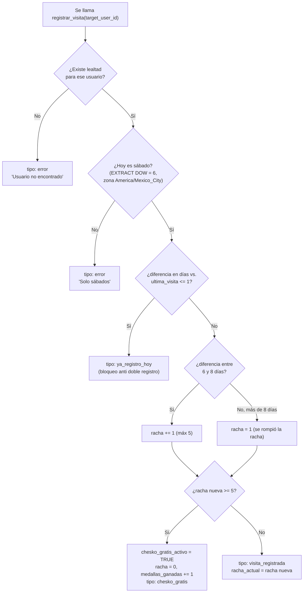

# Base de datos (Supabase / Postgres)

El esquema versionado vive en `sql/`:
- `sql/supabase-schema.sql` — script completo original (tablas + RLS +
  primeras funciones RPC), pensado para correr una sola vez en un proyecto
  nuevo de Supabase.
- `sql/rpc-functions-only.sql` — script de "solo funciones", para cuando las
  tablas ya existen y solo hace falta (re)crear/actualizar las funciones RPC
  (útil para migraciones incrementales).

Ambos son casi idénticos en las funciones que definen; `rpc-functions-only.sql`
es el que hay que ejecutar si ya tienes las tablas y solo quieres poner al
día la lógica de negocio.

## Row Level Security: deshabilitado a propósito

```sql
ALTER TABLE profiles        DISABLE ROW LEVEL SECURITY;
ALTER TABLE lealtad         DISABLE ROW LEVEL SECURITY;
ALTER TABLE historial_retos DISABLE ROW LEVEL SECURITY;
ALTER TABLE promociones     DISABLE ROW LEVEL SECURITY;
```

Decisión explícita del proyecto (comentario en el propio SQL): es una app de
negocio local con un admin físicamente presente; la seguridad se maneja a
nivel de aplicación (PIN + rol) y, sobre todo, dentro de las funciones RPC
`SECURITY DEFINER`, no con políticas RLS por fila.

## Diagrama entidad-relación

```mermaid
erDiagram
    PROFILES ||--o| LEALTAD : "1 a 1 (usuario_id)"
    PROFILES ||--o{ HISTORIAL_RETOS : "1 a N (usuario_id)"
    PROFILES ||--o{ PROMOCIONES : "creado_por (opcional)"
    PROFILES ||--o{ NOTIFICACIONES : "1 a N (usuario_id) *no versionado*"
    PROFILES ||--o{ PUSH_SUBSCRIPTIONS : "1 a N (usuario_id) *no versionado*"

    PROFILES {
        uuid id PK
        text username UK
        text telefono UK
        text pin "texto plano, ver ARCHITECTURE.md"
        text rol "admin | empleado | usuario"
        timestamptz creado_en
    }
    LEALTAD {
        uuid usuario_id PK_FK
        int racha_actual "0..5"
        date ultima_visita
        int medallas_ganadas
        bool chesko_gratis_activo
    }
    HISTORIAL_RETOS {
        uuid id PK
        uuid usuario_id FK
        text reto_id "coincide con CHALLENGES[].id en challenges.js"
        bool cumplio
        timestamptz fecha
    }
    PROMOCIONES {
        uuid id PK
        text titulo
        text descripcion
        bool activa
        uuid creado_por FK
        timestamptz creado_en
        timestamptz vence_en
    }
    NOTIFICACIONES {
        bigint id PK
        uuid usuario_id FK
        text tipo
        text icono
        text titulo
        text mensaje
        bool leida
        timestamptz creado_en
    }
    PUSH_SUBSCRIPTIONS {
        bigint id PK
        uuid usuario_id FK
        text endpoint
        text p256dh
        text auth_key
    }
```

Tablas marcadas `*no versionado*` (`NOTIFICACIONES`, `PUSH_SUBSCRIPTIONS`):
su estructura de columnas de arriba es una **inferencia** a partir de cómo
las usa `js/data.js` (`crearNotificacion`, `obtenerNotificaciones`,
`guardarPushSubscription`) — no de un `CREATE TABLE` real en este repo. Ver
sección "Faltantes" abajo.

## Funciones RPC versionadas en `sql/`

| Función | Firma | Para qué sirve | Quién la llama |
|---|---|---|---|
| `register_user` | `(p_username, p_phone, p_pin) → JSON` | Crea `profiles` + `lealtad` en una operación; valida que teléfono y username sean únicos. | `Auth.registrarUsuario` |
| `login_with_pin` | `(p_phone, p_pin) → JSON` | Verifica teléfono+PIN y devuelve el perfil si coincide. | `Auth.loginConPin` |
| `check_phone_exists` | `(phone_number) → BOOLEAN` | Chequeo previo de si un teléfono ya tiene cuenta. | `DataStore.telefonoExiste` |
| `registrar_visita` | `(target_user_id) → JSON` | **Toda** la lógica de negocio de la racha 5+1 (ver abajo). | `DataStore.registrarVisita` (vía `Loyalty.registrarVisita`) |

### Lógica de `registrar_visita` (racha 5+1)



Notas importantes:
- Todo el cálculo de fechas usa la zona horaria `America/Mexico_City`
  (`now() AT TIME ZONE 'America/Mexico_City'`), para que "sábado" y "mismo
  día" coincidan con la hora local del puesto sin importar dónde corra el
  servidor de Supabase.
- El bloqueo "solo sábados" es una regla de negocio explícita: aunque el
  staff intente escanear un QR en martes, la función devuelve `error` antes
  de tocar la racha.
- `racha_actual` tiene un `CHECK (racha_actual >= 0 AND racha_actual <= 5)`
  a nivel de columna, como segunda barrera además de la lógica en PL/pgSQL.

## Faltantes

Estas funciones/tablas son llamadas por el frontend (`js/data.js`) pero
**no existen** en ningún archivo `.sql` de este repositorio. Deben haberse
creado directamente en el SQL Editor del dashboard de Supabase en algún
momento y nunca se volcaron a un archivo versionado:

- `obtener_usuario_para_escaner(target_user_id)` — RPC `SECURITY DEFINER`
  usada por `DataStore.obtenerUsuarioCompleto()` para el flujo de escaneo
  staff. Según su comentario en `data.js`, expone `{ perfil, lealtad }` sin
  el teléfono, y lee `lealtad` aunque RLS estuviera activo (relevante si en
  algún momento se vuelve a activar RLS).
- `crear_notificacion(p_usuario_id, p_tipo, p_icono, p_titulo, p_mensaje)` —
  usada por `DataStore.crearNotificacion`.
- `guardar_push_subscription(p_usuario_id, p_endpoint, p_p256dh, p_auth_key)`
  — usada por `DataStore.guardarPushSubscription`.
- `obtener_push_subscriptions(p_usuario_id)` y
  `borrar_push_subscription(p_endpoint)` — usadas por `api/send-push.js`.
- Tabla `notificaciones` (columnas inferidas arriba) y una tabla de
  suscripciones push (nombre real desconocido; inferido como
  `push_subscriptions`).

**Recomendación** para quien retome este proyecto: exportar el esquema
actual desde el dashboard de Supabase (Database → Backups, o
`supabase db dump`) y añadir estas definiciones a un nuevo archivo, p. ej.
`sql/rpc-notificaciones-push.sql`, para que el repo vuelva a ser la fuente de
verdad completa del esquema.

## Convención de `reto_id`

`historial_retos.reto_id` es texto libre que debe coincidir con el `id` de
alguno de los objetos en `window.CHALLENGES` (`js/challenges.js`), por
ejemplo `"intelectual"`, `"volado"`, `"suertudote"`. No hay una tabla
`retos` en la base de datos — el catálogo de retos vive **solo** en el
frontend (`js/challenges.js`), y la base de datos únicamente guarda qué
`reto_id` completó cada usuario y cuándo. Si se renombra o elimina un `id`
en `challenges.js`, las filas históricas con ese `reto_id` quedan
"huérfanas" (el álbum simplemente no las reconocerá con nombre/emoji).
