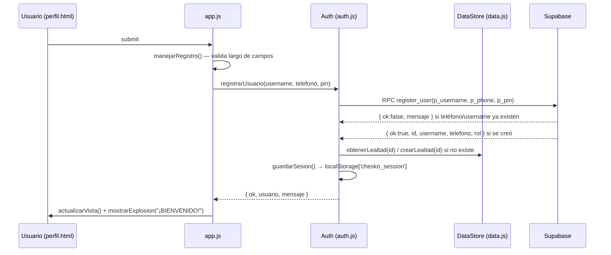
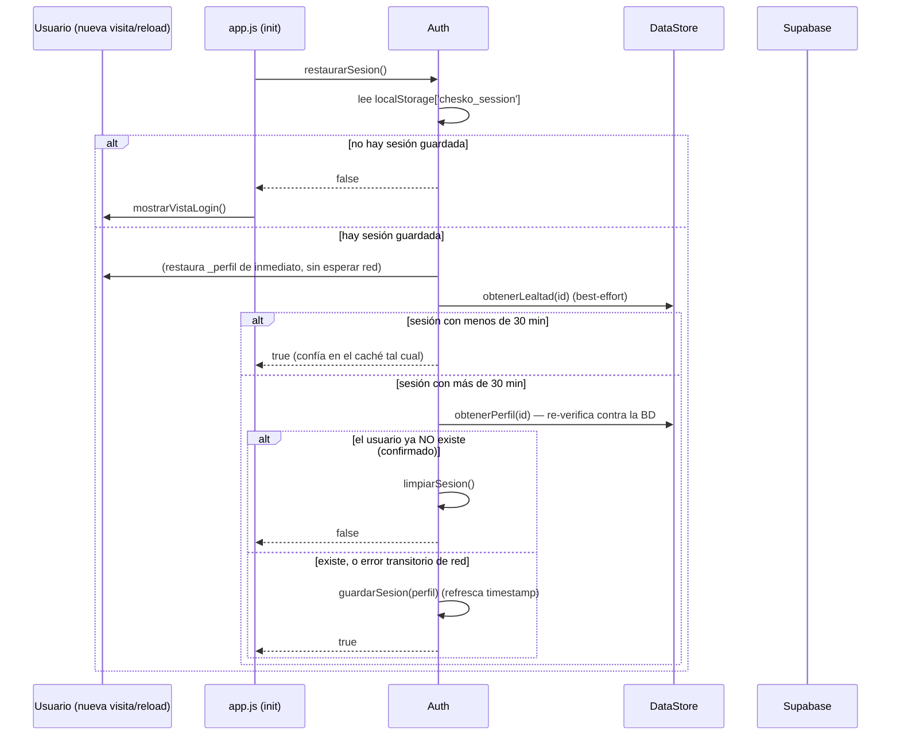
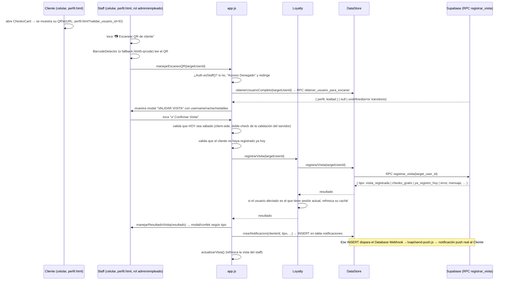
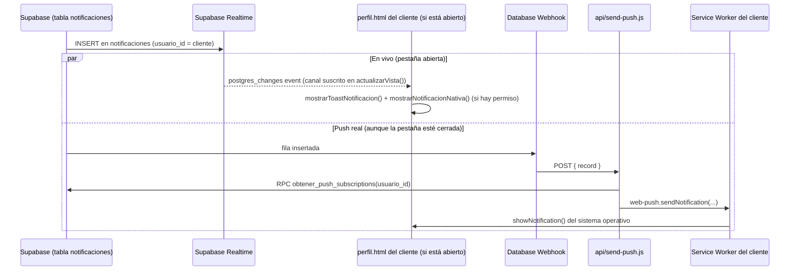

# Flujos de datos end-to-end

## 1. Registro de cuenta nueva



## 2. Login con PIN

Igual que el registro pero vía `login_with_pin(p_phone, p_pin)`; si el
teléfono+PIN no coinciden exactamente, la función devuelve
`{ ok:false, mensaje:"Teléfono o PIN incorrectos." }` sin distinguir cuál de
los dos falló (por diseño, para no filtrar si un teléfono existe).

## 3. Restaurar sesión al abrir la app



Diseño clave: un error de red/servidor **nunca** cierra la sesión por sí
solo — solo una confirmación explícita de "0 filas" (`PGRST116`) lo hace.
Esto evita que un CDN lento o un hiccup de conexión deslogueen al usuario en
medio del parque sin señal.

## 4. Registrar visita — escaneo QR por el staff

Este es el flujo central del negocio: el cliente muestra su QR (parte de su
CheskoCard en `perfil.html`), el staff (rol `admin`/`empleado`) lo escanea
con su propio celular, y el sistema decide si suma un sello, da el Chesko
gratis, o rechaza el registro.



La validación de "solo sábado" y "ya registró hoy" ocurre **dos veces**: una
vez en `confirmarVisitaEscaneada()` (JS, para dar feedback rápido sin ni
llamar al servidor) y otra dentro de la función SQL `registrar_visita`
(la autoridad real — el cliente JS nunca debe considerarse la fuente de
verdad de una regla de negocio).

## 5. Notificación al cliente (en vivo + push real)



La suscripción Realtime (`DataStore.suscribirNotificaciones`) solo funciona
mientras la pestaña de `perfil.html` está abierta; el push real (VAPID) es
lo único que llega con la app cerrada o el celular bloqueado — por eso
`perfil.html` ofrece el botón "🔔 ACTIVAR NOTIFICACIONES" además de la
suscripción Realtime automática.

## 6. Girar la ruleta y guardar el reto

```mermaid
sequenceDiagram
    participant U as Usuario (ruleta.html)
    participant Wheel as motor de ruleta (challenges.js)
    participant LS as localStorage
    participant Data as DataStore (si hay sesión)
    participant DB as Supabase

    U->>Wheel: toca "¡GIRAR!" (o barra espaciadora)
    Wheel->>Wheel: selectWinner() — sorteo ponderado por CHALLENGE_WEIGHTS\n(Fácil=5, Intermedio=4, Difícil=3, Especial=2, Extremo=1)
    Wheel->>Wheel: anima el giro, muestra modal de resultado + confeti + sonido
    Wheel->>LS: lee 'chesko_session' (¿hay usuario logueado en este navegador?)
    alt hay sesión
        Wheel->>Wheel: autoRegistrarParticipante() → agrega fila al scoreboard del día
        Wheel->>Data: registrarReto(usuario.id, reto.id, true) (best-effort, sin bloquear la UI)
        Data->>DB: INSERT historial_retos
    else no hay sesión
        Wheel->>Wheel: el resultado solo se muestra en pantalla; el staff puede\nregistrar manualmente el username en el formulario del scoreboard
    end
```

El "scoreboard" (`#scoreboardBody`) es **puramente local** a
`localStorage` (clave `cheskoretos_scoreboard_<fecha-de-hoy>`) — no se
sincroniza entre dispositivos ni se guarda en Supabase; es una pizarra del
día para el puesto físico, se resetea sola al cambiar de fecha.
