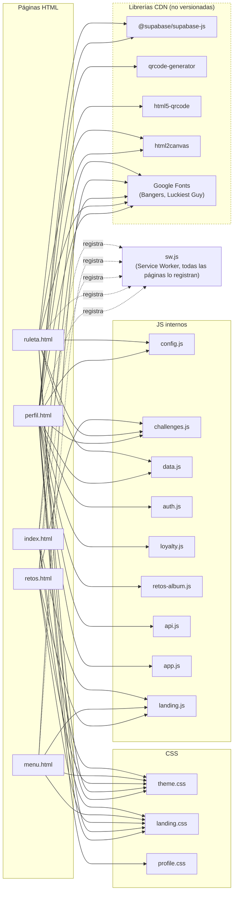
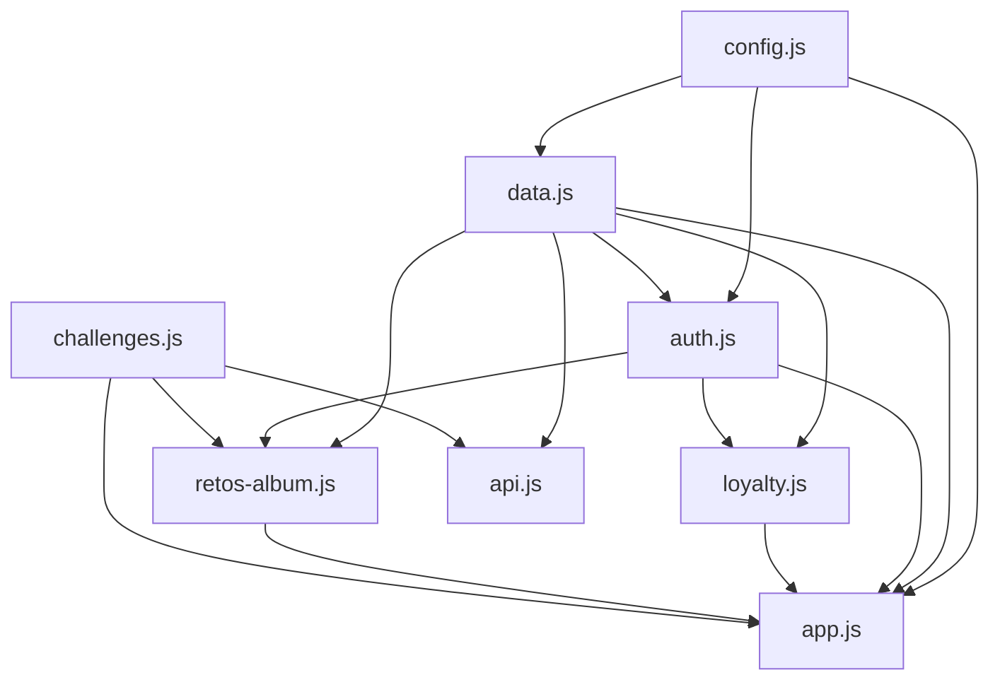

# Grafos del proyecto (índice visual)

Este documento reúne, en un solo lugar, todos los diagramas del proyecto.
Los diagramas están escritos en [Mermaid](https://mermaid.js.org/) — se
renderizan automáticamente en GitHub y en la mayoría de visores de Markdown
(incluyendo el propio Claude).

## 1. Grafo de inclusión de archivos (qué HTML carga qué CSS/JS)

Este es el grafo "físico": qué etiqueta `<link>`/`<script>` conecta cada
página con cada archivo estático. Las líneas punteadas son librerías por CDN
(no versionadas en este repo).

## 2. Grafo de dependencias entre módulos JS

Ver la versión detallada con la API de cada módulo en
[JS_MODULES.md](./JS_MODULES.md#grafo-de-dependencias). Resumen:

## 3. Navegación entre páginas

Ver [FRONTEND.md](./FRONTEND.md#navegación-entre-páginas) para el detalle del
"interceptor" del enlace Ruleta.

## 4. Arquitectura por capas (frontend / Vercel / Supabase / Google)

Ver [ARCHITECTURE.md](./ARCHITECTURE.md#diagrama-de-capas).

## 5. Entidad-relación de la base de datos

Ver [DATABASE.md](./DATABASE.md#diagrama-entidad-relación).

## 6. Flujos de negocio (secuencia)

Ver [DATA_FLOW.md](./DATA_FLOW.md) — incluye: registro, login, restaurar
sesión, escaneo QR + racha 5+1, notificaciones (Realtime + push), y girar la
ruleta.

## 7. Lógica de la racha de sábados (árbol de decisión)

Ver [DATABASE.md](./DATABASE.md#lógica-de-registrar_visita-racha-51).
