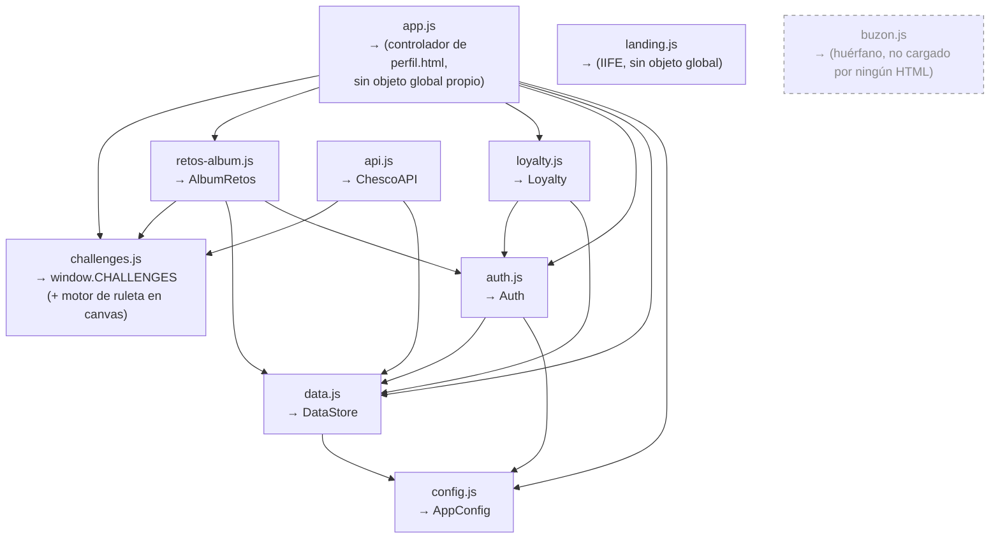

# Módulos JavaScript (`js/*.js`)

Todos los módulos "core" siguen el mismo patrón: un IIFE que expone un único
objeto global (`var X = (function(){ ...; return {...}; })();`) con una API
pública explícita. No hay `import`/`export` ni bundler — el orden de los
`<script>` en el HTML **es** el sistema de módulos, por eso el orden importa.

## Grafo de dependencias



(`CHESKORETOS` = `window.CHALLENGES`, definido por `challenges.js`, es dato
puro sin dependencias — la flecha va desde quien lo *consume*.)

## Orden de carga por página

| Página | Scripts internos (en orden) |
|---|---|
| `index.html` | `landing.js` |
| `menu.html` | `landing.js` |
| `retos.html` | `challenges.js`, `landing.js` |
| `ruleta.html` | `config.js`, `data.js`, `challenges.js` (+ SDK de Supabase por CDN) |
| `perfil.html` | `config.js`, `challenges.js`, `data.js`, `auth.js`, `loyalty.js`, `retos-album.js`, `api.js`, `app.js` (+ 2 scripts inline propios de la página) |

`perfil.html` es la única página que carga la pila completa porque es la
única que necesita sesión + lealtad + álbum + escáner.

## Referencia de cada módulo

### `config.js` → `AppConfig`
Inicializa el cliente de Supabase (`window.supabase.createClient`, cargado
por CDN) de forma perezosa (`getClient()`) y expone constantes de negocio.

```
AppConfig.getClient()          // instancia supabase-js (singleton)
AppConfig.SUPABASE_URL / SUPABASE_ANON_KEY
AppConfig.RACHA_MAX             // 5
AppConfig.SELLOS_PARA_GRATIS    // alias de RACHA_MAX
AppConfig.URL_BASE              // 'https://cheskoretos.vercel.app', usado para armar el QR
```

### `data.js` → `DataStore`
Única capa que habla con Supabase (tablas + RPC). Ningún otro módulo debe
llamar `AppConfig.getClient()` directamente salvo `auth.js` (ver nota abajo).
Todas las funciones son `async` y devuelven `Promise`.

- **Profiles**: `obtenerPerfil`, `obtenerPerfilPorTelefono`, `crearPerfil`,
  `actualizarPerfil`.
- **Lealtad**: `obtenerLealtad`, `crearLealtad`, `actualizarLealtad`.
- **Historial de retos**: `registrarReto`, `obtenerRetosCompletados`,
  `obtenerConteoPorReto`, `retoYaCompletado`.
- **RPC de verificación/registro**: `telefonoExiste` (→
  `check_phone_exists`), `registrarVisita` (→ `registrar_visita`).
- **Promociones**: `obtenerPromoActiva`, `obtenerPromosActivas`.
- **Ranking/widgets**: `obtenerRankingUsuarios`, `obtenerCromosUsuario`,
  `obtenerUsuarioCompleto` (→ RPC `obtener_usuario_para_escaner`, usada por
  el flujo de escaneo staff).
- **Notificaciones**: `crearNotificacion` (→ RPC `crear_notificacion`),
  `obtenerNotificaciones`, `marcarNotificacionLeida`,
  `suscribirNotificaciones` / `cancelarSuscripcion` (Supabase Realtime).
- **Push**: `guardarPushSubscription` (→ RPC `guardar_push_subscription`).
- `obtenerUltimoErrorPerfil()`: helper de diagnóstico, guarda el último error
  crudo de `obtenerPerfil`/`obtenerUsuarioCompleto` para poder mostrarlo en
  pantalla si algo falla (ver los mensajes `[DIAG]` en `app.js`).

> ⚠️ Varias RPC que `data.js` llama (`obtener_usuario_para_escaner`,
> `crear_notificacion`, `guardar_push_subscription`) **no están** en los
> archivos `sql/*.sql` de este repo — ver
> [DATABASE.md](./DATABASE.md#faltantes).

### `auth.js` → `Auth`
Sesión por PIN (sin SMS/email/OAuth). Mantiene estado en memoria
(`_usuarioActual`, `_perfil`, `_lealtad`) + espejo en `localStorage`
(`chesko_session`).

```
Auth.registrarUsuario(username, telefono, pin)  // RPC register_user + crea lealtad
Auth.loginConPin(telefono, pin)                 // RPC login_with_pin
Auth.restaurarSesion()                          // lee localStorage; ventana de 30 min sin re-verificar contra la BD
Auth.logout()
Auth.obtenerUsuarioActual()   // { authUser:{id}, perfil, lealtad } | null
Auth.obtenerPerfil()
Auth.refrescarDatos()         // recarga perfil + lealtad desde Supabase
Auth.esAdmin() / esEmpleado() / esStaff() / esUsuario() / obtenerRol()
```

Es el único módulo, junto con `data.js`, que llama `AppConfig.getClient()`
directamente (para las RPC de login/registro).

### `loyalty.js` → `Loyalty`
Envoltura de negocio sobre la RPC `registrar_visita` (la lógica pesada de
racha vive en SQL, ver [DATABASE.md](./DATABASE.md)).

```
Loyalty.registrarVisita(targetUserId)   // usado por el flujo de escaneo (staff → otro usuario)
Loyalty.registrarMiVisita()             // auto-registro (no usado activamente en la UI actual, pero disponible)
Loyalty.canjearCheskoGratis()
Loyalty.obtenerEstadoLealtad()          // racha, restantes, si puede registrar hoy, etc. (usa TZ America/Mexico_City)
Loyalty.RACHA_MAX  // 5
```

### `retos-album.js` → `AlbumRetos`
Renderiza el álbum de "cromos" en `perfil.html` a partir de
`window.CHALLENGES` + el historial del usuario.

```
AlbumRetos.marcarReto(retoId, cumplio)
AlbumRetos.marcarRetoComoCumplido(retoId)     // alias de compatibilidad
AlbumRetos.obtenerRetosCompletados()
AlbumRetos.contarRetosCompletados()           // retos ÚNICOS completados (para el contador del header)
AlbumRetos.renderizarAlbumDeRetos(contenedorId)  // async — pinta el grid con medallas 🥉🥈🥇 (5 / 15 repeticiones)
```

### `challenges.js` → `window.CHALLENGES` + motor de ruleta
Ver [FRONTEND.md](./FRONTEND.md) para el detalle de sus dos mitades (datos
vs. motor de canvas). Expone también, como globals sueltos (no agrupados en
un objeto), `CHALLENGE_COLORS`, `CHALLENGE_EMOJIS`, `CHALLENGE_WEIGHTS` y los
helpers `getChallengeColor/Emoji/Weight`, `getDiscountText*`.

### `api.js` → `ChescoAPI`
Capa fina que envuelve a `DataStore` para devolver respuestas ya
formateadas como JSON de "endpoint" (`{ ok, endpoint, data, timestamp }`),
pensada para alimentar widgets (p. ej. una futura TWA/Android). No se
consume activamente desde ninguna página HTML hoy — está lista para usarse.

```
ChescoAPI.obtenerRankingUsuarios()
ChescoAPI.obtenerCromosUsuario(userId)
ChescoAPI.obtenerPromoActiva()
ChescoAPI.obtenerEstadoLealtad(userId)
ChescoAPI.obtenerDashboard()
```

### `app.js` → controlador de `perfil.html`
No expone un objeto global: es un único IIFE que hace *wiring* de todo el
DOM de `perfil.html` con los módulos de arriba. Puntos clave (numerados como
en los propios comentarios del archivo):

1. Inicialización (`init`): restaura sesión, detecta `?validar_usuario_id=`
   en la URL (llegó por QR escaneado) y decide si mostrar login o perfil.
2. `bindEventos()`: todos los `addEventListener` de la página.
3–4. Registro y login (delegan en `Auth`, muestran errores inline).
5. `manejarResultadoVisita()`: traduce el `tipo` devuelto por
   `registrar_visita` (`ya_registro_hoy`, `chesko_gratis`,
   `visita_registrada`, `error`) a UI (modal/confeti/cupón).
6. Escáner QR (staff): `manejarEscaneoQR` → muestra modal de confirmación →
   `confirmarVisitaEscaneada` (valida sábado + no duplicado, llama
   `Loyalty.registrarVisita`, y notifica al cliente vía
   `DataStore.crearNotificacion`).
7. `actualizarVista()`: sincroniza toda la UI con el estado de `Auth` +
   suscribe Realtime a notificaciones.
8–11. Render de perfil, sellos de racha, cupón gratis.
12. Generación de QR (`qrcode-generator`), Google Wallet, notificaciones
    push (VAPID).
13. Escáner de cámara nativo (`BarcodeDetector`, con *fallback* a
    `html5-qrcode`).
14. Overlay fullscreen de la tarjeta + efectos visuales (confeti, luces).
15. Arranque (`DOMContentLoaded → init`).

> Nota: `app.js` referencia `btnGoogleWallet` (`$('btnGoogleWallet')`), pero
> `perfil.html` ya no tiene ese botón en el DOM (se retiró junto con
> Descargar/Compartir tarjeta). Como `$` es `getElementById` y todo el código
> chequea `if (btnGoogleWallet)` antes de usarlo, esto **no rompe nada** —
> simplemente esa función queda inactiva hasta que se reintroduzca el botón
> o se retire el código muerto.

### `landing.js`
IIFE sin objeto global, usado por `index.html`, `menu.html` y `retos.html`.
Crea las luces de feria de fondo, controla el modal de aviso del tianguis
(intercepta `.btn-girar-ruleta`, ver [FRONTEND.md](./FRONTEND.md)) y maneja
el envío **local** (sin red) del formulario de sugerencias.

### `buzon.js` (huérfano)
Implementación alternativa del envío del formulario de sugerencias, esta vez
sí por `fetch` real a Formspree. **No está incluido en ningún `<script>`** de
`index.html` — solo aparece precacheado en `sw.js`. Ver
[FILE_MAP.md](./FILE_MAP.md) para más detalle.
